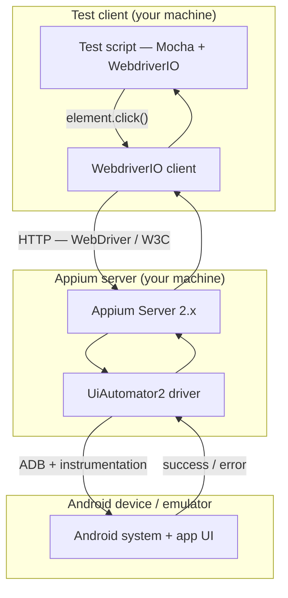

# Day 1 — Appium Request Flow (Mini-Assignment)

This note explains what happens when a test issues a command such as `await element.click()`, from the test script down to the Android emulator and back.

---

## Architecture at a Glance



---

## Step-by-Step: `element.click()` End to End

### 1. Test script (Mocha spec)

You write something like:

```js
const button = await $('~submit');
await button.click();
```

The spec is the **business intent**: “click the submit control.” It does not talk to the phone directly.

### 2. WebdriverIO client

WebdriverIO resolves `button` to a **WebDriver element id** (from an earlier `find element` call) and sends an HTTP request to the URL configured in `wdio.conf.js` (typically `http://127.0.0.1:4723`).

For a click, the client issues a **WebDriver / W3C** command equivalent to “perform pointer down/up on this element” (or the legacy JSON Wire Protocol equivalent on older setups).

**Role:** Test framework + HTTP client. Translates JavaScript API calls into protocol messages.

### 3. Appium Server

Appium listens on a port (default **4723**). It:

- Maintains a **session** tied to your **capabilities** (platform, app package, device, automation name).
- Parses the incoming command.
- Delegates Android UI work to the installed **automation driver** (here: **UiAutomator2**).

**Role:** Central hub. One entry point for many clients (WDIO, Inspector, etc.) and many platforms/drivers.

### 4. UiAutomator2 driver (Appium driver plugin)

This is **not** the same as “UiAutomator” inside your test code selectors. It is Appium’s **driver plugin** that:

- Talks to the device over **ADB**.
- Uses **UiAutomator2** on the device to find elements and perform actions.
- Maps WebDriver commands (`click`, `send keys`, `get attribute`, etc.) to Android-specific operations.

**Role:** Platform bridge between Appium’s generic WebDriver API and Android.

### 5. Android emulator (or physical device)

On the device:

- The **instrumentation** / UiAutomator2 server receives the action.
- The target **view** in the app (e.g. ApiDemos) receives a real **touch/click**.
- The UI updates (navigation, dialog, state change).

**Role:** Where the user-visible behavior actually happens.

### 6. Response path (back to the test)

Success or failure (element not found, stale element, timeout) propagates:

**Device → driver → Appium → WebdriverIO → your test**

WDIO returns control to your `await`; you can assert on the next screen with `expect(...)`.

---

## Components Summary

| Component | Location | Responsibility |
|-----------|----------|----------------|
| **Test script** | Your repo (`*.spec.js`) | Scenarios and assertions |
| **WebdriverIO** | Node.js process running tests | API + HTTP client to Appium |
| **Appium Server** | Local process (`appium`) | Session management, command routing |
| **UiAutomator2 driver** | Appium plugin | Android-specific automation |
| **ADB** | Host ↔ device channel | Install, shell, port forwarding |
| **Emulator / device** | Android Studio AVD | Runs the app under test |

---

## How a Session Fits In

Before any `click()` works, WDIO/Appium **creates a session** using **capabilities**, for example:

- `platformName: Android`
- `appium:automationName: UiAutomator2`
- `appium:appPackage` / `appium:appActivity`

That session tells Appium **which driver**, **which app**, and **which device** every later command targets. Without an active session, `element.click()` has nowhere to go.

---

## Desired Capabilities vs W3C Capabilities

Historically, tests used **Desired Capabilities** (JSON objects passed at session start). Modern Appium aligns with the **W3C WebDriver** capability format (prefixes like `appium:appPackage`). WebdriverIO still exposes these in `capabilities` in config; Appium normalizes them when creating the session.

---

## Why UiAutomator2 for Android

- Maintained and recommended for current Android versions.
- Good performance and stability vs older drivers (e.g. deprecated Bootstrap).
- Supports modern locator strategies (`-android uiautomator`, accessibility id, etc.).
- Default choice for Appium 2 Android automation in this learning program.

---

## Day 1 Outcome Checklist

- [ ] Emulator running (`adb devices` shows a device)
- [ ] `appium` starts without errors
- [ ] `appium driver list` includes **uiautomator2**
- [ ] Can explain the diagram above without reading from a script

---

*Part of the Mobile Automation Learning Program — WebdriverIO + Appium (Android).*
