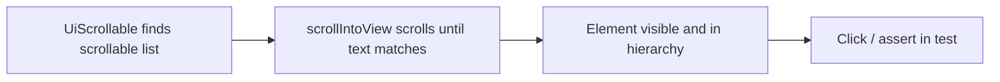

# Day 2 — Appium Inspector and Locator Strategies

Hands-on notes for **ApiDemos** (`io.appium.android.apis`). Use **Appium Inspector** connected to your emulator with the same capabilities as `wdio.conf.js` (UiAutomator2, `appPackage`, `appActivity`).

**Locator priority (Android):** accessibility id → resource id → `-android uiautomator` → xpath (last resort).

---

## Inspector connection (quick reference)

| Capability | Value |
|------------|--------|
| `platformName` | `Android` |
| `appium:automationName` | `UiAutomator2` |
| `appium:udid` | `emulator-5554` (your device from `adb devices`) |
| `appium:appPackage` | `io.appium.android.apis` |
| `appium:appActivity` | Your launcher activity (from `adb shell cmd package resolve-activity ...`) |

Navigate in the app while Inspector refreshes the XML tree. Copy locators from the **Selector** or **Attributes** panel and paste into Inspector’s search to confirm uniqueness.

---

## Hands-on — 15 elements, best locators, and justification

Elements are spread across **home**, **Views**, **Content**, and **Graphics** so you practice more than one screen. WDIO examples use `$('...')`.

| # | Screen path | Element | Best locator (WebdriverIO) | Why this over alternatives |
|---|-------------|---------|----------------------------|----------------------------|
| 1 | ApiDemos home | **Views** menu row | `$('~Views')` | **Accessibility id** matches visible label; stable and readable. Prefer over xpath like `//android.widget.TextView[@text='Views']` (brittle hierarchy). |
| 2 | ApiDemos home | **Content** menu row | `$('~Content')` | Same as above—**content-desc** is the intended automation hook on list rows. `UiSelector().text("Content")` works but duplicates what accessibility id already provides. |
| 3 | ApiDemos home | **Graphics** menu row (may need scroll on small screens) | `$('android=new UiScrollable(new UiSelector().scrollable(true)).scrollIntoView(new UiSelector().text("Graphics"))')` | **UiScrollable** required when the item is off-screen; text-only `~Graphics` fails if not visible. Avoid long xpath through `ListView`. |
| 4 | Views | **Controls** sub-menu | `$('~Controls')` | Accessibility id on a standard list item. Resource id is often absent on menu `TextView`s. |
| 5 | Views → Controls | **1. Light Theme** | `$('android=new UiSelector().text("1. Light Theme")')` | Exact **text** on a titled row; no shared resource id. Accessibility id may be missing on older ApiDemos builds—verify in Inspector. |
| 6 | Views → Controls → Light Theme | **Email / text field** | `$('id:io.appium.android.apis:id/edit')` | **Resource id** is unique on this screen. Prefer over xpath `//EditText`. `~` not set on this field in most builds. |
| 7 | Views → Controls → Light Theme | **Checkbox** | `$('id:io.appium.android.apis:id/check1')` | Stable **resource id**; faster than xpath. Label text can change; id does not. |
| 8 | Views → Controls → Light Theme | **Toggle** button | `$('id:io.appium.android.apis:id/toggle')` | Same—id is the contract with the layout. `text("Toggle")` is weaker if label is localized. |
| 9 | Views → Controls → Light Theme | **Radio 1** | `$('id:io.appium.android.apis:id/radio_off')` | Distinguishes radios by **id**; `text("Radio 1")` is readable but ambiguous if duplicate labels exist elsewhere. |
| 10 | Views | **Lists** sub-menu | `$('~Lists')` | Accessibility id on list entry—consistent with other main-menu items under Views. |
| 11 | Views → Lists → Array | **List item “Mauritius”** (off-screen until scroll) | `$('android=new UiScrollable(new UiSelector().scrollable(true)).scrollIntoView(new UiSelector().text("Mauritius"))')` | **UiScrollable** is the Android-native way to scroll lists; xpath `//text='Mauritius'` is slow and breaks when hierarchy changes. |
| 12 | Views | **Date Widgets** | `$('~Date Widgets')` | Accessibility id; clear intent for navigation specs (Day 5 date picker). |
| 13 | Views → Date Widgets → Dialog | **Change the date** button | `$('id:io.appium.android.apis:id/changeDate')` | Resource id in ApiDemos date dialog layout. Prefer over button index xpath. *Confirm id in Inspector if your APK differs.* |
| 14 | Content | **Assets** | `$('~Assets')` | Standard menu row under Content; same pattern as Views/Content on home. |
| 15 | Content → Assets | **Read Asset** button | `$('id:io.appium.android.apis:id/resolver')` | ApiDemos uses **`resolver`** id for the read action on Assets screen. Prefer id over `textContains` if multiple buttons share similar labels. *Verify in Inspector.* |

### How to validate each locator in Inspector

1. Select the element in the **App Source** tree.
2. Note **content-desc**, **resource-id**, and **text** in attributes.
3. Paste the locator into Inspector’s **Find By** / search field (strategy: `-android uiautomator`, `accessibility id`, or `id` as appropriate).
4. Confirm **exactly one** node is highlighted before you rely on it in tests.

### If your APK differs

ApiDemos builds from different releases may rename an id (e.g. `changeDate`). Re-inspect and update the table row—**the decision rule stays the same**: accessibility id → id → UiAutomator → xpath.

---

## Locator syntax cheat sheet (WebdriverIO + Appium)

| Strategy | WDIO example | When to use |
|----------|--------------|-------------|
| Accessibility id | `$('~Views')` | `content-desc` present (best default) |
| Resource id | `$('id:io.appium.android.apis:id/edit')` | `@+id/...` in layout |
| UiAutomator | `$('android=new UiSelector().text("Controls")')` | Text/class/containers; scrolling |
| XPath | `$('//android.widget.Button[@text="Toggle"]')` | Last resort—slow, brittle |

---

## Mini-assignment — `UiScrollable.scrollIntoView`

**Goal:** Bring a specific list item into view on a scrollable screen, then interact with it. Classic ApiDemos path: **Views → Lists → 1. Array** → scroll to **Mauritius**.

### Selector (UiAutomator2)

**Appium Inspector / `-android uiautomator`:**

```text
new UiScrollable(new UiSelector().scrollable(true)).scrollIntoView(new UiSelector().text("Mauritius"))
```

**WebdriverIO:**

```js
const mauritius = $(
  'android=new UiScrollable(new UiSelector().scrollable(true)).scrollIntoView(new UiSelector().text("Mauritius"))'
);
await mauritius.waitForDisplayed({ timeout: 15000 });
await mauritius.click();
```

**Variant** (pin scrollable list when multiple scroll areas exist):

```text
new UiScrollable(new UiSelector().scrollable(true).instance(0)).scrollIntoView(new UiSelector().text("Mauritius"))
```

### Verify in Appium Inspector

1. Start session on ApiDemos; open **Views → Lists → 1. Array**.
2. Set find strategy to **-android uiautomator** (or **Android UI Automator**).
3. Paste the selector above (without the `android=` prefix in some Inspector versions—follow the UI label).
4. Click **Search** — the **Mauritius** row should highlight without manual swipe.
5. Optionally tap **Tap** in Inspector to confirm the row opens the expected detail/toast.

### What scrollIntoView is doing



- **`scrollable(true)`** — targets a scrollable container (usually the `ListView`).
- **`scrollIntoView(...)`** — performs flings until the inner `UiSelector` matches.
- Prefer this over chaining many **swipe** gestures for long lists (Day 4 scenario).

### Common failures

| Symptom | Likely cause | Fix |
|---------|----------------|-----|
| No element found | Wrong screen or typo in text | Open Array list; match exact case `Mauritius` |
| Scrolls but never finds | Item not in this list | Confirm you are on **1. Array**, not **1. Custom** |
| Multiple matches | Too generic inner selector | Add `.instance(0)` on scrollable or narrow text |
| Works in Inspector, fails in WDIO | Timing | `waitForDisplayed` before `click` |

---

## Practice checklist (Day 2 outcome)

- [ ] Inspector session connects to ApiDemos on the emulator
- [ ] Documented **15 elements** (table above; adjust ids if your APK differs)
- [ ] For each element, tried at least one weaker locator and noted why it was rejected
- [ ] **UiScrollable `scrollIntoView`** locates **Mauritius** in Inspector without manual scroll
- [ ] Can explain locator priority in your own words

---

## Related

- [Day 1 — Appium architecture](day1-appium-architecture.md)
- Day 3+ tests: `test/specs/light-theme.controls.spec.js` (uses resource ids from the Light Theme screen)

---

*Part of the Mobile Automation Learning Program — WebdriverIO + Appium (Android).*
